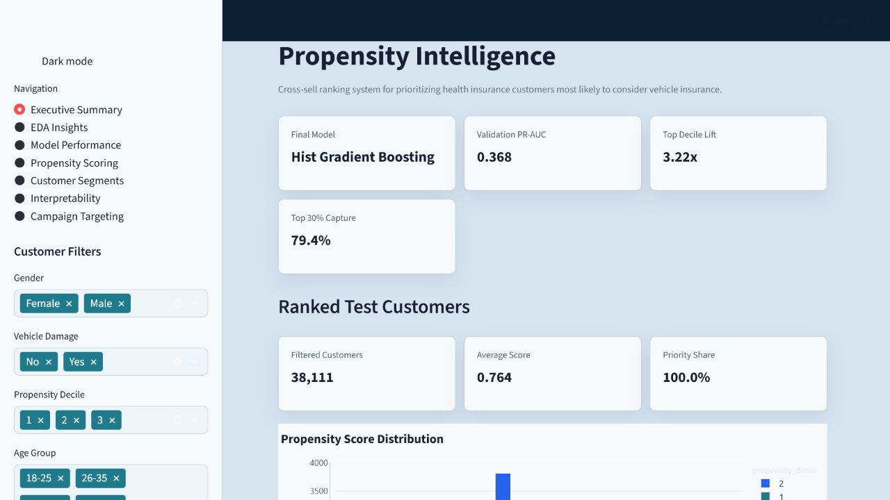

# Insurance Customer Propensity Prediction & Customer Intelligence

Enterprise-grade Data Science portfolio project for predicting which existing health insurance customers are most likely to purchase vehicle insurance. The project combines data quality control, leakage-safe feature engineering, propensity modeling, customer ranking, interpretability, SQL analysis, campaign targeting simulation, and a Streamlit scoring dashboard.

[](https://insurance-propensity-intelligence.streamlit.app)

Live demo: `https://insurance-propensity-intelligence.streamlit.app`



## Executive Summary

Insurance cross-sell campaigns often lose efficiency when every customer receives the same outreach. This project builds a propensity ranking system that helps marketing and sales teams prioritize customers with the highest predicted likelihood of responding to vehicle insurance offers.

The final validation model is **Hist Gradient Boosting**, selected by ranking performance and business usefulness:

| Metric | Validation Result |
|---|---:|
| ROC-AUC | 0.8585 |
| PR-AUC | 0.3685 |
| Balanced Accuracy @ 0.50 | 0.8022 |
| Top Decile Lift | 3.22x |
| Capture Rate at Top 10% | 32.25% |
| Capture Rate at Top 20% | 58.26% |
| Capture Rate at Top 30% | 79.40% |

This is a propensity and ranking solution, not a claim of guaranteed conversion, revenue uplift, or campaign ROI.

## Business Problem

The company has already sold health insurance and wants to identify customers who are likely to consider vehicle insurance. A broad campaign can create unnecessary outreach cost, low conversion quality, and weak prioritization for sales teams.

## Business Solution

The solution ranks customers by predicted purchase propensity, assigns propensity deciles, produces a Kaggle-style submission, and creates a customer intelligence layer for campaign segmentation. Business users can focus on high-propensity customers first, review segment patterns, and export scored customer lists from the dashboard.

## Dataset

Source: [Health Insurance Cross Sell Prediction by anmolkumar on Kaggle](https://www.kaggle.com/datasets/anmolkumar/health-insurance-cross-sell-prediction)

The dataset contains customer demographics, vehicle-related attributes, policy sales channel information, and the target variable `Response`.

| File | Rows | Columns | Role |
|---|---:|---:|---|
| `data/raw/train.csv` | 381,109 | 12 | Model training and validation |
| `data/raw/test.csv` | 127,037 | 11 | Batch scoring only |
| `data/raw/sample_submission.csv` | 127,037 | 2 | Submission format reference |

Target column: `Response`  
Positive response rate: 12.26%  
Important leakage rule: `test.csv` is never used for training, and `id` is treated as an identifier, not a predictive feature.

## Data Quality Summary

The raw dataset is healthy and ready for professional modeling:

- Missing values: 0 in train, test, and sample submission
- Duplicate rows: 0 in train and test
- Unique IDs: valid in train, test, and sample submission
- Train/test schema: aligned except for the target column in train
- Sample submission IDs: aligned with `test.csv`
- Class balance: imbalanced binary classification with 12.26% positive response rate
- Annual premium outliers: reviewed with an IQR-based audit and retained as valid business variation

Detailed reports:

- `outputs/reports/data_quality_report.md`
- `outputs/reports/data_quality_report.json`

## EDA Highlights

Observed response patterns from the training data:

- Customers with prior vehicle damage show much stronger response concentration: 23.77% vs. 0.52% without damage.
- Customers not previously insured are materially stronger cross-sell opportunities: 22.55% vs. 0.09%.
- Vehicle age matters: `> 2 Years` has the highest observed response rate at 29.37%.
- The engineered `Priority` cross-sell segment has a 30.88% observed response rate.
- Age bands `36-45` and `46-55` show stronger response rates than younger and older groups.

These are associative targeting signals, not causal claims.

## Feature Engineering

The pipeline creates business-readable and model-ready features:

- `age_group`
- `premium_band`
- `vintage_band`
- `vehicle_age_encoded`
- `vehicle_damage_flag`
- `not_previously_insured_flag`
- `high_premium_flag`
- `customer_risk_segment`
- `cross_sell_opportunity_segment`
- `Region_Code_response_rate_te`
- `Policy_Sales_Channel_response_rate_te`
- `propensity_decile` after prediction

Target encoding is performed with out-of-fold training folds only. Validation and test rows are transformed with mappings learned from training data, preventing target leakage.

## Modeling Methodology

The project compares multiple model families:

| Model | ROC-AUC | PR-AUC | Top Decile Lift | Top 30% Capture |
|---|---:|---:|---:|---:|
| Hist Gradient Boosting | 0.8585 | 0.3685 | 3.22x | 79.40% |
| Random Forest | 0.8573 | 0.3668 | 3.22x | 79.04% |
| Logistic Regression | 0.8494 | 0.3397 | 2.96x | 78.00% |

Primary selection criterion: ranking quality for campaign prioritization, with PR-AUC, ROC-AUC, lift, and capture rate reviewed together.

## Lift and Campaign Simulation

Validation deciles show strong response concentration at the top of the ranking:

| Decile | Customers | Response Rate | Lift | Cumulative Capture |
|---:|---:|---:|---:|---:|
| 1 | 7,623 | 39.53% | 3.22x | 32.25% |
| 2 | 7,622 | 31.88% | 2.60x | 58.26% |
| 3 | 7,622 | 25.91% | 2.11x | 79.40% |

Recommended campaign strategy:

1. Start with decile 1 for highest-priority outreach.
2. Expand to deciles 1-3 when campaign capacity allows broader reach.
3. Keep lower deciles for nurture, testing, or holdout measurement.

## Interpretability

Global interpretation is generated from validation-set permutation importance. The codebase is SHAP-ready and will use SHAP if the optional dependency is installed.

Top drivers in this environment:

| Feature | Importance |
|---|---:|
| `Previously_Insured` | 0.0532 |
| `Policy_Sales_Channel_response_rate_te` | 0.0483 |
| `customer_risk_segment` | 0.0404 |
| `vehicle_damage_flag` | 0.0391 |
| `Age` | 0.0327 |
| `cross_sell_opportunity_segment` | 0.0289 |

Report: `outputs/reports/interpretability_report.md`

## Professional Documentation Pack

The project includes recruiter- and interview-ready documentation:

- `docs/CASE_STUDY.md`
- `docs/MODEL_CARD.md`
- `docs/DATA_DICTIONARY.md`
- `docs/DEPLOYMENT_GUIDE.md`
- `docs/PORTFOLIO_WEBSITE_COPY.md`

## Dashboard

The Streamlit dashboard uses a professional dual-mode color system designed for portfolio presentation. Light mode uses the requested `#D6E4F0` background with high-contrast navy text. Dark mode uses a navy analytics theme with bright cyan/teal accents. Plotly charts, metric cards, filters, tables, and buttons are explicitly styled so screenshots remain readable in both modes.

Dashboard pages:

- Executive Summary
- EDA Insights
- Model Performance
- Propensity Scoring
- Customer Segments
- Interpretability
- Campaign Targeting

Run locally:

```bash
python -m streamlit run streamlit_app/app.py
```

Verified local URL in this environment:

```text
http://localhost:8501
```

Dashboard screenshot files:

- `outputs/charts/dashboard_executive_preview.png`
- `streamlit_app/assets/dashboard_executive_preview.png`

Full dashboard screenshot pack:

- `outputs/dashboard_screenshots/`
- `streamlit_app/assets/dashboard_screenshots/`

Each dashboard page is exported in both modes:

- `executive_summary_light.png` / `executive_summary_dark.png`
- `eda_insights_light.png` / `eda_insights_dark.png`
- `model_performance_light.png` / `model_performance_dark.png`
- `propensity_scoring_light.png` / `propensity_scoring_dark.png`
- `customer_segments_light.png` / `customer_segments_dark.png`
- `interpretability_light.png` / `interpretability_dark.png`
- `campaign_targeting_light.png` / `campaign_targeting_dark.png`

Portfolio website cover images:

- `outputs/portfolio_assets/insurance_propensity_cover_light.png`
- `outputs/portfolio_assets/insurance_propensity_cover_dark.png`
- `streamlit_app/assets/portfolio_assets/insurance_propensity_cover_light.png`
- `streamlit_app/assets/portfolio_assets/insurance_propensity_cover_dark.png`

Analysis chart assets for case-study sections:

- `outputs/charts/`
- `streamlit_app/assets/analysis_charts/`

## Key Outputs

| Artifact | Path |
|---|---|
| Final model bundle | `models/final_propensity_model.joblib` |
| Processed train data | `data/processed/train_processed.csv` |
| Processed test data | `data/processed/test_processed.csv` |
| Test customer scores | `outputs/predictions/test_customer_scores.csv` |
| Kaggle-style submission | `outputs/submission/submission.csv` |
| Model comparison | `outputs/reports/model_comparison.csv` |
| Validation decile report | `outputs/reports/validation_decile_report.csv` |
| Dashboard screenshot | `outputs/charts/dashboard_executive_preview.png` |
| Dashboard screenshot pack | `outputs/dashboard_screenshots/` |
| Portfolio cover images | `outputs/portfolio_assets/` |
| Case study documentation | `docs/CASE_STUDY.md` |
| Model card | `docs/MODEL_CARD.md` |

## How to Reproduce

Python compatibility:

- Local environment verified with Python `3.13.1`
- Project configuration is standardized on Python `>=3.13,<3.14`
- For Streamlit Community Cloud, choose Python `3.13` in Advanced settings so local and deployed environments stay aligned

Create and activate an environment, then install dependencies:

```bash
pip install -r requirements.txt
```

Run the complete pipeline:

```bash
python scripts/run_project_pipeline.py
```

Run tests:

```bash
pytest
```

Launch the dashboard:

```bash
python -m streamlit run streamlit_app/app.py
```

Optional direct links for screenshot or portfolio QA:

```text
http://localhost:8501/?page=executive-summary&theme=light
http://localhost:8501/?page=model-performance&theme=dark
```

## GitHub and Streamlit Deployment

Recommended GitHub repository settings:

- Repository name: `insurance-propensity-intelligence`
- Description: `End-to-end insurance cross-sell propensity modeling, customer intelligence, and Streamlit scoring dashboard.`
- Visibility: `Public`
- Add README: `Off`
- Add .gitignore: `None`
- Add license: `None` or add one later after reviewing dataset/license needs

After pushing to GitHub, deploy on Streamlit Community Cloud:

- Repository: `felixsihite/insurance-propensity-intelligence`
- Branch: `main`
- Main file path: `streamlit_app/app.py`
- App URL/subdomain: `insurance-propensity-intelligence`
- Python version: choose `3.13` in Advanced settings

If Streamlit asks for dependencies, keep `requirements.txt` in the repository root. Optional modeling accelerators are separated into `requirements-optional.txt` and are not required for the deployed dashboard.

## Project Structure

```text
insurance_customer_propensity_prediction_&_customer_intelligence/
  data/
    raw/
    processed/
  docs/
    CASE_STUDY.md
    MODEL_CARD.md
    DATA_DICTIONARY.md
    DEPLOYMENT_GUIDE.md
    PORTFOLIO_WEBSITE_COPY.md
  notebooks/
    01_data_quality_and_eda.ipynb
    02_feature_engineering.ipynb
    03_model_training_and_evaluation.ipynb
    04_model_interpretability_and_business_insights.ipynb
  src/insurance_propensity/
    data/
    features/
    models/
    evaluation/
    reporting/
    visualization/
    scoring/
  sql/
    customer_analysis.sql
    segment_performance.sql
    propensity_reporting.sql
  streamlit_app/
    app.py
    assets/
  models/
  outputs/
    charts/
    dashboard_screenshots/
    portfolio_assets/
    predictions/
    reports/
    submission/
  scripts/
  tests/
```

## Portfolio Value

This project demonstrates the end-to-end Data Scientist workflow expected in a professional analytics environment:

- Data contract validation and quality auditing
- Leakage-safe feature engineering
- Imbalanced binary classification
- Ranking-oriented evaluation
- Lift/gain and campaign targeting simulation
- Reusable model scoring bundle
- SQL customer intelligence reporting
- Executive-ready dashboard
- Reproducible folder structure and tests
